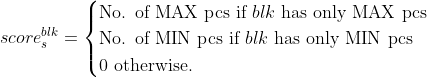
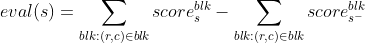

# Minimax with Alpha-Beta Pruning for Connect 4

Python Implementation of Connect 4 using alpha-beta pruning.

# Execution

`python minimax-connect4.py`

By default, the user will be the first player and the search depth is 4. Use `--aifirst` to be the second player. Provide an integer in the command to adjust the search depth.

# Heuristic Function

The heuristic function is designed to capture the advantage of the last piece at position (r, c) based on the total scores of all affected blocks (a block is a group of 4 consecutive positions that contain (r,c)) before and after the piece is inserted into (r,c).

Denote s to be the current state and s- to be the state before the last piece is inserted, and  the score of a block blk for state s, which is defined as

The heuristic value of a state s is then

 

Hence, the output of the evaluation function can be seen as an estimation of the advantage of landing a piece at (r,c) at s-. The algorithm searches for moves that maximize this advantage. This heuristic function is quite effective. Even with a shallow search depth (<=3), the AI has decent performance.